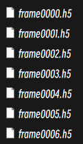
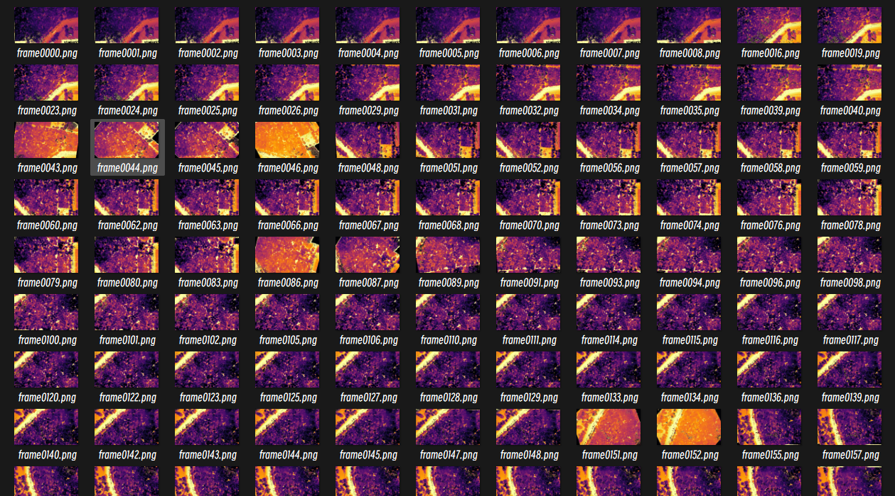

# This repo is creation for training LoFTR on custom dataset

This is the initial LoFTR [README](docs/README.md) file.

As we all know, training LoFTR is not easy, I mean the official dont offer too much info for training our own custom datasets, so I give it a try.


This repo finishs the following things:

- [x] Using Colmap for sparse reconstruction.

- [x] Using Colmap for dense reconstruction and generate depth map.

- [x] Convert depth.bin to depth.h5 file.

- [x] Convert camera params to .npz file.

- [x] Automatically Generate train data structure as MegaDepth format.

- [x] Modify a little code because of the errors in the initial LoFTR.

# Environment
you should follow the README file of LoFTR to prepare the Environment.
```python
conda env create -f environment.yaml
conda activate loftr
pip install -r requirements_loftr.txt
```

`requirements_loftr.txt` is my environment.


# Prepare your own data
## 1.Using Colmap for sparse reconstruction and dense reconstruction
First of all, you should install [Colmap](https://github.com/colmap/colmap) (best cuda version).

If you have your own COLMAP dataset without undistortion (e.g., using OPENCV camera), you can try to just run the last part of the script: 
Put the images in input and the COLMAP info in a subdirectory distorted:
```
<location>
|---input
|   |---<image 0>
|   |---<image 1>
|   |---...
```
Then run
```python
python generate_train_data/colmap_convert.py -s <location> [--skip_matching] [--resize] #If not resizing, ImageMagick is not needed
 
# the input dir is in the <location>
```
After running the command, you will get the sparse reconstruction and the depth maps.

```
<location>
|---input
|   |---<image 0>
|   |---<image 1>
|   |---...
|---images
|   |---<image 0>
|   |---<image 1>
|   |---...
|---distorted
    |---database.db
    |---sparse
        |---0
            |---...
|---sparse
|   |---0
        |---cameras.bin
        |---images.bin
        |---points3D.bin
        |---cameras.txt
        |---images.txt
        |---points3D.txt
    |---cameras.bin
    |---images.bin
    |---points3D.bin
|---stereo
    |---depth_maps
        |---image_0.photometric.bin
        |---image_1.photometric.bin
        |---...
    |---normal_maps
        |---image_0.photometric.bin
        |---image_1.photometric.bin
        |---...
```


## 2.Converting depth.bin to depth.h5 file
Then run the following command to convert the depth.bin to depth.h5 file:
```python
python generate_train_data/read_depth.py \
    --depth_map_dir YOUR_COLMAP_DEPTH_MAP_DIR \
    --normal_map_dir YOUR_COLMAP_NORMAL_MAP_DIR \
    --output_dir YOUR_OUTPUT_h5_DEPTH_DIR
```

Then you will get the following data dir:

```
<location>
|---input
|   |---<image 0>
|   |---<image 1>
|   |---...
|---images
|   |---<image 0>
|   |---<image 1>
|   |---...
|---depths
|   |---<image 0>.h5
|   |---<image 1>.h5
|   |---...
|---depth_image
|   |---<image 0>
|   |---<image 1>
|   |---...
|---distorted
    |---database.db
    |---sparse
        |---0
            |---...
|---sparse
|   |---0
        |---cameras.bin
        |---images.bin
        |---points3D.bin
        |---cameras.txt
        |---images.txt
        |---points3D.txt
    |---cameras.bin
    |---images.bin
    |---points3D.bin
|---stereo
    |---depth_maps
        |---image_0.photometric.bin
        |---image_1.photometric.bin
        |---...
    |---normal_maps
        |---image_0.photometric.bin
        |---image_1.photometric.bin
        |---...
```

depths dir contain the following files:



depth_image dir contain the following files:




## 3.Automatically generate the train data as MegaDepth format

Then run the following command to generate train data:

```python
python generate_train_data/preprocess_scene.py --base_path YOUR_BASE_PATH --scene_name YOUR_SCENE_NAME
```

Then you will get the following data dir:

```
<location>
|---input
|   |---<image 0>
|   |---<image 1>
|   |---...
|---images
|   |---<image 0>
|   |---<image 1>
|   |---...
|---depths
|   |---<image 0>.h5
|   |---<image 1>.h5
|   |---...
|---depth_image
|   |---<image 0>
|   |---<image 1>
|   |---...
|---sparse
|   |---0
        |---cameras.bin
        |---images.bin
        |---points3D.bin
        |---cameras.txt
        |---images.txt
        |---points3D.txt
    |---cameras.bin
    |---images.bin
    |---points3D.bin
|---<scene_name>
|   |---index
|       |---scene_info
|           |---<scenen_name>_train.npz
|           |---<scenen_name>_val.npz
|           |---<scenen_name>_test.npz
|       |---trainvaltest_list
|           |---train_list.txt
|           |---val_list.txt
|           |---test_list.txt
|   |---test
|       |---depths
|           |---image0.h5
|           |---image1.h5
|           |---...
|       |---images
|           |---image0.png
|           |---image1.png
|           |---...
|   |---train
|       |---depths
|           |---image0.h5
|           |---image1.h5
|           |---...
|       |---images
|           |---image0.png
|           |---image1.png
|           |---...
|   |---val
|       |---depths
|           |---image0.h5
|           |---image1.h5
|           |---...
|       |---images
|           |---image0.png
|           |---image1.png
|           |---...
```

If you want to combine the val and test data, you should move the `val/depths/* and val/images/*` to `test/depths* and test/images` respectively.

And `just` modify the `index/trainvaltest_list/test_list.txt`, as the following shows:

test_list.txt
```
<scene_name>_test
<scene_name>_val
```

Finally move the `<scene_name>` dir to `LoFTR_Project/data`

# 4.Modify Config file
Using the template creating your data config file. And copy the config to the `LoFTR_Project/configs/data` dir.

change `YOUR_DATA_SCENE`

```python
from configs.data.base import cfg

TRAIN_BASE_PATH = "data/YOUR_DATA_SCENE/index"
cfg.DATASET.TRAINVAL_DATA_SOURCE = "MegaDepth"
cfg.DATASET.TRAIN_DATA_ROOT = "data/YOUR_DATA_SCENE/train"
cfg.DATASET.TRAIN_NPZ_ROOT = f"{TRAIN_BASE_PATH}/scene_info"
cfg.DATASET.TRAIN_LIST_PATH = f"{TRAIN_BASE_PATH}/trainvaltest_list/train_list.txt"
cfg.DATASET.MIN_OVERLAP_SCORE_TRAIN = 0.0

TEST_BASE_PATH = "data/YOUR_DATA_SCENE/index"
cfg.DATASET.TEST_DATA_SOURCE = "MegaDepth"
cfg.DATASET.VAL_DATA_ROOT = cfg.DATASET.TEST_DATA_ROOT = "data/YOUR_DATA_SCENE/test"
cfg.DATASET.VAL_NPZ_ROOT = cfg.DATASET.TEST_NPZ_ROOT = f"{TEST_BASE_PATH}/scene_info"
cfg.DATASET.VAL_LIST_PATH = cfg.DATASET.TEST_LIST_PATH = f"{TEST_BASE_PATH}/trainvaltest_list/test_list.txt"
cfg.DATASET.MIN_OVERLAP_SCORE_TEST = 0.0   # for both test and val

# 368 scenes in total for MegaDepth
# (with difficulty balanced (further split each scene to 3 sub-scenes))
cfg.TRAINER.N_SAMPLES_PER_SUBSET = 100

cfg.DATASET.MGDPT_IMG_RESIZE = 640  # for training on 11GB mem GPUs
```

# 5.Full command
```python
# 1. first step
python generate_train_data/colmap_convert.py -s <location> 

# 2. second step
python generate_train_data/read_depth.py \
    --depth_map_dir <location>/stereo/depth_maps \
    --normal_map_dir <location>/stereo/normal_maps \
    --output_dir <location>

# 3. third step
python generate_train_data/preprocess_scene.py --base_path <location> --scene_name <scene_name>

# change <location> and <scene_name> for your data
```


Then you could train your own LoFTR model happily!😊